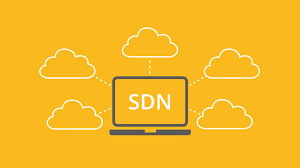
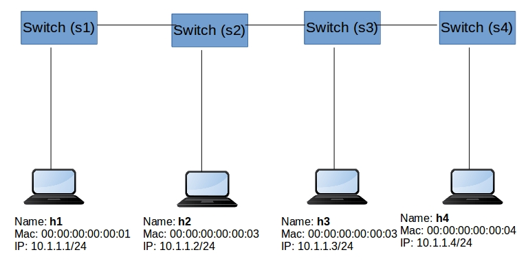

<h1 align="center">
  </img>
  <br>
  <b>OpenFlow SDN</b>
</h1>

<p align="center">Learn SDN with OpenFlow</p>

<!-- Badges -->
<p align="center">
  <a href="https://github.com/HCMUS-Project-Org/openflow-sdn/graphs/contributors">
    
  </a>
  <a href="">
    
  </a>
  <a href="https://github.com/HCMUS-Project-Org/openflow-sdn/network/members">
    
  </a>
  <a href="https://github.com/HCMUS-Project-Org/openflow-sdn/stargazers">
    
  </a>
  <a href="https://github.com/HCMUS-Project-Org/openflow-sdn/issues/">
    
  </a>
  <a href="https://github.com/HCMUS-Project-Org/openflow-sdn/blob/main/LICENSE">
    
  </a>
</p>

<p align="center">
  <b>
      <a href="https://github.com/HCMUS-Project-Org/openflow-sdn">Documentation</a> •
      <a href="https://github.com/HCMUS-Project-Org/openflow-sdn/issues/">Report Bug</a> •
      <a href="https://github.com/HCMUS-Project-Org/openflow-sdn/issues/">Request Feature</a>
  </b>
</p>

<br/>

<details open>
<summary><b>📖 Table of Contents</b></summary>

- [Key features](#key-features)
- [Getting start](#getting-start)
  - [Prerequisites](#prerequisites)
  - [Run locally](#run-locally)
- [Contributors](#contributors)
- [Credits](#credits)
- [License](#license)
</details>

# Key features

# Getting start

This project with aim to learn **SDN** using `Linear topology` with **`OpenFlow`**

> **Linear topology:** each switch has one host
>
> 

## Prerequisites

- **SSHPass**: install instruction [here](https://gist.github.com/arunoda/7790979)
- **Virtualbox**: `>= v6.1.0`, download [here](https://www.virtualbox.org/wiki/Downloads)

## Run locally

Clone this repository

```bash
git clone https://github.com/HCMUS-Project-Org/openflow-sdn.git
```

Auto download, run and config `Mininet VM`

> In `mininet_setup.sh`, it's automatic:
>
> - Set **Port Forwarding** for SSH with `Host Port: 2222` and `Guest Port: 22`
> - Add virtual machine to `Known Hosts`
> - Copy `l2_pairs.py` file to Mininet machine

```bash
bash ./mininet_setup.sh
```

Connect to Mininet VM (with `-X` flag for X11 forwarding)

> Mininet default account:
>
> - **Username**: `mininet`
> - **Password**: `mininet`

```bash
sshpass -p "mininet" ssh mininet@localhost -p 2222 -X
```

```bash
Welcome to Ubuntu 20.04.1 LTS (GNU/Linux 5.4.0-42-generic x86_64)

 * Documentation:  https://help.ubuntu.com
 * Management:     https://landscape.canonical.com
 * Support:        https://ubuntu.com/advantage

New release '22.04.3 LTS' available.
Run 'do-release-upgrade' to upgrade to it.

Last login: Wed Feb 10 21:03:31 2021
mininet@mininet-vm:~$
```

Install **`Linear topology`** with `4 Switch` in Mininet machine

```bash
sudo -E mn --controller=remote,ip=127.0.0.1 --mac -i 10.1.1.0/24 --switch=ovsk --topo=linear,4
```

```text
*** Creating network
*** Adding controller
Unable to contact the remote controller at 127.0.0.1:6653
Unable to contact the remote controller at 127.0.0.1:6633
Setting remote controller to 127.0.0.1:6653
*** Adding hosts:
h1 h2 h3 h4
*** Adding switches:
s1 s2 s3 s4
*** Adding links:
(h1, s1) (h2, s2) (h3, s3) (h4, s4) (s2, s1) (s3, s2) (s4, s3)
*** Configuring hosts
h1 h2 h3 h4
*** Starting controller
c0
*** Starting 4 switches
s1 s2 s3 s4 ...
*** Starting CLI:
```

Run `POX` controller with `l2_pairs`

```bash
sudo ~/pox/pox.py forwarding.l2_pairs info.packet_dump samples.pretty_log log.level --DEBUG
```

```text
POX 0.7.0 (gar) / Copyright 2011-2020 James McCauley, et al.
INFO:forwarding.l2_pairs:Pair-Learning switch running.
INFO:info.packet_dump:Packet dumper running
[core] POX 0.7.0 (gar) going up...
[core] Running on CPython (3.8.5/Jul 28 2020 12:59:40)
[core] Platform is Linux-5.4.0-42-generic-x86_64-with-glibc2.29
[version] Support for Python 3 is experimental.
[core] POX 0.7.0 (gar) is up.
[openflow.of_01] Listening on 0.0.0.0:6633
[openflow.of_01] [00-00-00-00-00-04 2] connected
[openflow.of_01] [00-00-00-00-00-01 3] connected
[openflow.of_01] [00-00-00-00-00-03 4] connected
[openflow.of_01] [00-00-00-00-00-02 5] connected
```

In `Mininet` machine run `h1` ping `h2`

```bash
h1 ping h2 -c 1
```

```text
PING 10.1.1.2 (10.1.1.2) 56(84) bytes of data.
64 bytes from 10.1.1.2: icmp_seq=1 ttl=64 time=10.7 ms
--- 10.1.1.2 ping statistics ---
1 packets transmitted, 1 received, 0% packet loss, time 0ms
rtt min/avg/max/mdev = 10.675/10.675/10.675/0.000 ms
```

Watch `POX` controller's logs

```bash
sudo ~/pox/pox.py forwarding.l2_pairs info.packet_dump samples.pretty_log log.level --DEBUG
```

```text
POX 0.7.0 (gar) / Copyright 2011-2020 James McCauley, et al.
INFO:forwarding.l2_pairs:Pair-Learning switch running.
INFO:info.packet_dump:Packet dumper running
[core] POX 0.7.0 (gar) going up...
[core] Running on CPython (3.8.5/Jul 28 2020 12:59:40)
[core] Platform is Linux-5.4.0-42-generic-x86_64-with-glibc2.29
[version] Support for Python 3 is experimental.
[core] POX 0.7.0 (gar) is up.
[openflow.of_01] Listening on 0.0.0.0:6633
[openflow.of_01] [00-00-00-00-00-04 2] connected
[openflow.of_01] [00-00-00-00-00-01 3] connected
[openflow.of_01] [00-00-00-00-00-03 4] connected
[openflow.of_01] [00-00-00-00-00-02 5] connected
[forwarding.l2_pairs] --------------------------------------------
[forwarding.l2_pairs] Packet source: 00:00:00:00:00:01 -- port: 1
[forwarding.l2_pairs] Packet dest : ff:ff:ff:ff:ff:ff -- port: None
[forwarding.l2_pairs] >> FLOOD
[dump:00-00-00-00-00-01 ] [ethernet][arp]
[forwarding.l2_pairs] --------------------------------------------
[forwarding.l2_pairs] Packet source: 00:00:00:00:00:01 -- port: 2
[forwarding.l2_pairs] Packet dest : ff:ff:ff:ff:ff:ff -- port: None
[forwarding.l2_pairs] >> FLOOD
[dump:00-00-00-00-00-02 ] [ethernet][arp]
[forwarding.l2_pairs] --------------------------------------------
[forwarding.l2_pairs] Packet source: 00:00:00:00:00:01 -- port: 2
[forwarding.l2_pairs] Packet dest : ff:ff:ff:ff:ff:ff -- port: None
[forwarding.l2_pairs] >> FLOOD
[dump:00-00-00-00-00-03 ] [ethernet][arp]
[forwarding.l2_pairs] --------------------------------------------
[forwarding.l2_pairs] Packet source: 00:00:00:00:00:02 -- port: 1
[forwarding.l2_pairs] Packet dest : 00:00:00:00:00:01 -- port: 2
[forwarding.l2_pairs] >> FLOW MOD
[forwarding.l2_pairs] Installing 00:00:00:00:00:02 -> 00:00:00:00:00:01
[dump:00-00-00-00-00-02 ] [ethernet][arp]
[forwarding.l2_pairs] --------------------------------------------
[forwarding.l2_pairs] Packet source: 00:00:00:00:00:01 -- port: 2
[forwarding.l2_pairs] Packet dest : ff:ff:ff:ff:ff:ff -- port: None
[forwarding.l2_pairs] >> FLOOD
[dump:00-00-00-00-00-04 ] [ethernet][arp]
[forwarding.l2_pairs] --------------------------------------------
[forwarding.l2_pairs] Packet source: 00:00:00:00:00:02 -- port: 2
[forwarding.l2_pairs] Packet dest : 00:00:00:00:00:01 -- port: 1
[forwarding.l2_pairs] >> FLOW MOD
[forwarding.l2_pairs] Installing 00:00:00:00:00:02 -> 00:00:00:00:00:01
[dump:00-00-00-00-00-01 ] [ethernet][arp]
[forwarding.l2_pairs] --------------------------------------------
[forwarding.l2_pairs] Packet source: 00:00:00:00:00:01 -- port: 1
[forwarding.l2_pairs] Packet dest : 00:00:00:00:00:02 -- port: 2
[forwarding.l2_pairs] >> FLOOD
[dump:00-00-00-00-00-01 ] [ethernet][ipv4][icmp][echo][56 bytes]
[forwarding.l2_pairs] --------------------------------------------
[forwarding.l2_pairs] Packet source: 00:00:00:00:00:01 -- port: 2
[forwarding.l2_pairs] Packet dest : 00:00:00:00:00:02 -- port: 1
[forwarding.l2_pairs] >> FLOOD
[dump:00-00-00-00-00-02 ] [ethernet][ipv4][icmp][echo][56 bytes]
[forwarding.l2_pairs] --------------------------------------------
[forwarding.l2_pairs] Packet source: 00:00:00:00:00:01 -- port: 2
[forwarding.l2_pairs] Packet dest : 00:00:00:00:00:02 -- port: None
[forwarding.l2_pairs] >> FLOOD
[dump:00-00-00-00-00-03 ] [ethernet][ipv4][icmp][echo][56 bytes]
[forwarding.l2_pairs] --------------------------------------------
[forwarding.l2_pairs] Packet source: 00:00:00:00:00:01 -- port: 2
[forwarding.l2_pairs] Packet dest : 00:00:00:00:00:02 -- port: None
[forwarding.l2_pairs] >> FLOOD
[dump:00-00-00-00-00-04 ] [ethernet][ipv4][icmp][echo][56 bytes]
[forwarding.l2_pairs] --------------------------------------------
[forwarding.l2_pairs] Packet source: 00:00:00:00:00:01 -- port: 1
[forwarding.l2_pairs] Packet dest : 00:00:00:00:00:02 -- port: 2
[forwarding.l2_pairs] >> FLOOD
[dump:00-00-00-00-00-01 ] [ethernet][arp]
[forwarding.l2_pairs] --------------------------------------------
[forwarding.l2_pairs] Packet source: 00:00:00:00:00:01 -- port: 2
[forwarding.l2_pairs] Packet dest : 00:00:00:00:00:02 -- port: 1
[forwarding.l2_pairs] >> FLOOD
[dump:00-00-00-00-00-02 ] [ethernet][arp]
[forwarding.l2_pairs] --------------------------------------------
[forwarding.l2_pairs] Packet source: 00:00:00:00:00:01 -- port: 2
[forwarding.l2_pairs] Packet dest : 00:00:00:00:00:02 -- port: None
[forwarding.l2_pairs] >> FLOOD
[dump:00-00-00-00-00-03 ] [ethernet][arp]
[forwarding.l2_pairs] --------------------------------------------
[forwarding.l2_pairs] Packet source: 00:00:00:00:00:01 -- port: 2
[forwarding.l2_pairs] Packet dest : 00:00:00:00:00:02 -- port: None
[forwarding.l2_pairs] >> FLOOD
[dump:00-00-00-00-00-04 ] [ethernet][arp]
```

> **Note**
> If you're using Linux Bash for Windows, [see this guide](https://www.howtogeek.com/261575/how-to-run-graphical-linux-desktop-applications-from-windows-10s-bash-shell/) or use `node` from the command prompt.

# Contributors

<a href="https://github.com/HCMUS-Project-Org/openflow-sdn/graphs/contributors">
  
</a>

Contributions are always welcome!

# Credits

This software uses the following open source packages:

- [OpenFlow](https://www.opennetworking.org/sdn-resources/openflow/)
- [Mininet](http://mininet.org/)
- [Mininet topology](https://github.com/knetsolutions/learn-sdn-with-ryu/blob/master/mininet_part1.md)

Emoji and Badges from:

- [github@WebpageFX](https://github.com/WebpageFX/emoji-cheat-sheet.com) - Emoji

# License

Distributed under the MIT License. See <a href="./LICENSE">`LICENSE`</a> for more information.

---

> Bento [@quanblue](https://bento.me/quanblue) &nbsp;&middot;&nbsp;
> GitHub [@QuanBlue](https://github.com/QuanBlue) &nbsp;&middot;&nbsp; Gmail quannguyenthanh558@gmail.com
